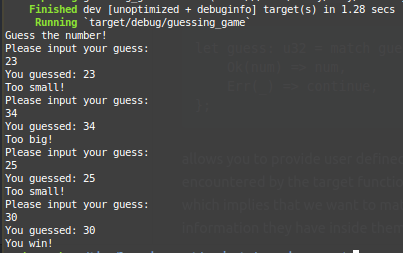

# Guessing Game

## Prelude
The *prelude* is a list of things that Rust automatically imports into every
rust program.  
Rust inserts:
```r
extern crate std;
```
into the crate root of every crate, and
```r
use std::prelude::v1::*;
```
into every module.

**NOTE:** Other preludes exist (in the standard library and/or in other libraries in the rust ecosystem) but are not `use`'d automatically, and must be imported manually.

 If a type you want to use is not in the prelude, you have to bring it into the
 scope explicitly with a `use` statement. i.e;
 ```r
 use std::io;
 ```
`std::io` - provides a number of useful `io`-related features e.g accepting
user input.

## Variables
Variables are created using the `let` statement e.g:
```r
let mut guess = String::new();
let bar = foo;
```
Variables in Rust are immutable by default and the `mut` statement is used to
make a variable mutable.

`String::new()` - returns a new instance of a `String` which is a string type that is a growable, UTF-8 encoded bit of text.

`::` as in `::new` indicate that new is an *associated function* of the string
type. An associated function is implemented on a type rather than on an instance. It is equivalent to a *static method* in some languages.

`io::stdin()` - returns an instance of `std::io::Stdin`, which is a type that represents a handle to get input from the user.

The line `.read_line(&mut guess)`, calls the `read_line` method on the standard input handle to get input from the user.

`read_line` takes whatever the user types into the standard input and places it into the passed in string (`&mut guess`) in this case. The string needs to be mutable.

The `&` indicates that the argument is a reference. Like variables, references are immutable by default hence we need to write `&mut guess` instead of `&guess` to make the reference to `guess` mutable.

## Handling Potential Failure with the `Result` Type
```r
.expect("Failed to read line");
```
The `read_line` method has a return type of `io:Result`. Rust has a number of types named `Result` in its standard library: a generic `Result` as well as specific versions for submodules, such as `io::Result`.

The `Result` types are enumerations types with the variants `Ok` and `Err`. The purpose of `Result` is to encode error handling information.

Values of the `Result` type, like any type, have methods defined on them. An instance of `io::Result` has an `expect` method that will cause the program to crash if the its value is `Err` and display the message you passed in to `expect`. If its value is `Ok`, it will return the original function's return value, in this case, the number of bytes in what the user entered to the standard output.

If we do not call `expect` a compile time warning will be displayed informing us of a non-handled possible error.
```r
warning: unused `std::result::Result` which must be used
  --> src/main.rs:10:5
   |
10 |     io::stdin().read_line(&mut guess);
   |     ^^^^^^^^^^^^^^^^^^^^^^^^^^^^^^^^^^
   |
   = note: #[warn(unused_must_use)] on by default
```

## Using Placeholders with `println!`
The `{}` contained in the string passed as an argument to the macro `println!` is a placeholder that is replaced by the second argument to the macro `println!`. Multiple placeholders can be used and their respective values provided.


## Using external dependencies
Add the line:
```r
extern crate rand;      // rand = crate name
```
to inform Rust that you will be using an external dependency. It does the equivalent of calling `use rand` meaning, we can call anything within *rand* by prefixing it with `rand::`

`use rand::Rng` - Places Rng, which is a trait that defines methods used by random number generators, in the scope as it is required in order to use the random number generating methods.

`rand::thread_rng()` - gives us a random number generator (RNG) for use, that is local to the current thread and is seeded by the OS.

`.gen_range()` - is defined by the `Rng` trait and is called on the RNG. Accepts two parameters `(lower_limit, upper_limit)` and returns a number in within the limits exclusive of the upper limit.

`use std:cmp:Ordering` - brings `Ordering`, which is another `enum` like `Result` into the scope. `Ordering` variants are `Less`, `Greater` and `Equal` which are the three outcomes that are possible when you compare two values.

The `match` expression is used to decide what to do next based on which variant of `Ordering` was returned from the call to `cmp`. The `match` expression is comparable to the `switch... case...` in C. It is made up of *arms*. An *arm* consists of a *pattern* and the code that should be run if the value at the beginning of the `match` expression fits that arms's pattern.

## Parsing a string to obtain a number
```r
let mut guess = String::new();

io::stdin().read_line(&mut guess)
    .expect("Failed to read line");

// remove edge characters(' ', '\r', '\n') and parse string to obtain a number
let guess: u32 = guess.trim().parse()
    .expect("Please type a number!");
```
The reuse of the variable `guess` is possible because Rust allows us to *Shadow* variable names. The colon `:` after guess tells Rust to annotate the variable's type. The `parse` method returns a `Result` to allow for error handling using `expect`.

## Looping
The `loop` keyword gives us an infinite loop i.e:
```r
loop {
  // statements
}
```
You can terminate the loop using a `break` statement.

## Handling invalid input
Switching from an `expect` call to a `match` expression i.e:
```r
let guess: u32 = match guess.trim().parse() {
    Ok(num) => num,
    Err(_) => continue,
};
```
allows you to provide user defined course of action in case an error is encountered by the target function. The `_` in `Err` is a catchall value, which implies that we want to match all `Err` values, no matter what information they have inside them.

## All work and no play, makes Sam a dull boy.

